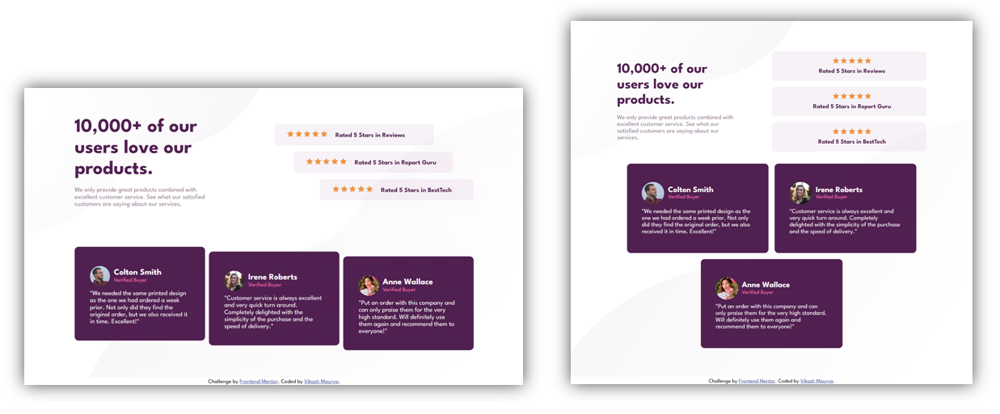

# Frontend Mentor - Social proof section solution

This is a solution to the [Social proof section challenge on Frontend Mentor](https://www.frontendmentor.io/challenges/social-proof-section-6e0qTv_bA).

## Table of contents

- [Overview](#overview)
  - [The challenge](#the-challenge)
  - [Screenshot](#screenshot)
  - [Links](#links)
- [My process](#my-process)
  - [Built with](#built-with)
  - [What I learned](#what-i-learned)
  - [Useful resources](#useful-resources)
- [Author](#author)

## Overview

### The challenge

Users should be able to:

- View the optimal layout for the section depending on their device's screen size

### Screenshot




### Links

- Solution URL: [get solution🌐](https://github.com/VikashMaurya10/social-proof-section-master)
- Live Site URL: [view🌐](https://vikashmaurya10.github.io/social-proof-section-master/)

## My process

### Built with

- Semantic HTML5 markup
- SCSS custom properties
- Flexbox
- Mobile-first workflow

### What I learned

By taking this task I understand how to create star-rating design.
To see how you can add code snippets, see below:

```css
.star-rating {
  &::before {
    content: url("../assets/images/icon-star.svg") "     "
      url("../assets/images/icon-star.svg") "     "
      url("../assets/images/icon-star.svg") "     "
      url("../assets/images/icon-star.svg") "     "
      url("../assets/images/icon-star.svg");
  }
}
```

- In this code snippets the Empty string is represented the gap between the star-rating images.

### Useful resources

- [Figma](https://www.figma.com) - This helped me for measuring the actual design. I really liked this pattern and will use it going forward.
- [Read Artical](https://webdesign.tutsplus.com/tutorials/a-simple-javascript-technique-for-filling-star-ratings--cms-29450) - This is an amazing article which helped me finally understand how to design five star-rating by css. I'd recommend it to anyone still learning this concept.

## Author

- Frontend Mentor - [@vikashmaurya](https://www.frontendmentor.io/profile/VikashMaurya10)
- LinkedIn - [@in-vikashmaurya](https://www.linkedin.com/in/in-vikashmaurya)
